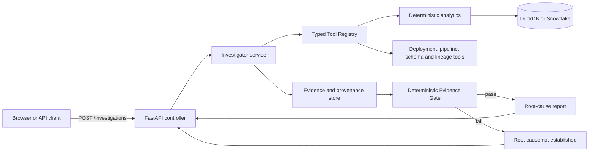

# InsightIQ Architecture

## Before: manual batch investigation

The legacy workflow is sequential and person-dependent. Calculations, operational metadata, and
causal reasoning live in different tools, while rejected explanations and source-level provenance
are usually lost.

## After: evidence-grounded REST service

## Layer mapping

| Layer | Implementation | Responsibility |
|---|---|---|
| DTO/contracts | `src/insightiq/models.py` | Validated requests, state, evidence, hypotheses, reports |
| Controller | `src/insightiq/api/main.py` | REST endpoints, background execution, response models |
| Service | `src/insightiq/agent/investigator.py` | Investigation loop, prioritization, recursion, stopping |
| Planner | `src/insightiq/agent/providers.py` | Deterministic or OpenAI selection of one controlled action |
| Tool boundary | `src/insightiq/tools/registry.py` | Discovery, schemas, allowlisting, validated invocation |
| Data access | `src/insightiq/tools/warehouse.py` | Parameterized deterministic calculations and metadata reads |
| Trust | `src/insightiq/trust/` | Evidence validation, confidence, gate, provenance graph |
| Storage | `src/insightiq/storage.py` | MVP in-memory investigation records |

## Request flow

1. The controller validates an investigation question.
2. The Investigator derives a question context and competing hypotheses.
3. It prioritizes the most valuable unresolved evidence requirement.
4. The planner selects exactly one discovered, allowlisted tool.
5. The application validates arguments, executes deterministic code, and records provenance.
6. Evidence updates hypotheses; supported broad hypotheses may create a recursive question.
7. The Evidence Gate either publishes a traceable chain or returns **Root cause not established**.

## Trust and security boundaries

- The model never performs KPI arithmetic or confidence calculations.
- The model cannot generate arbitrary SQL; it receives only registered function schemas.
- Observed evidence must cite a recorded execution, query identifier, and source.
- Inferred causal links are explicitly labeled and cite the evidence from which they were derived.
- Hidden ground truth is available only to the evaluation harness.
- The API key is read server-side from environment configuration and never returned to the UI.

## Deployment shape

The local MVP runs FastAPI and DuckDB in one process and stores active investigations in memory.
The production-oriented path replaces DuckDB with Snowflake and applies the included dbt models.
Before horizontal scaling, the in-memory repository must be replaced by durable shared storage.

