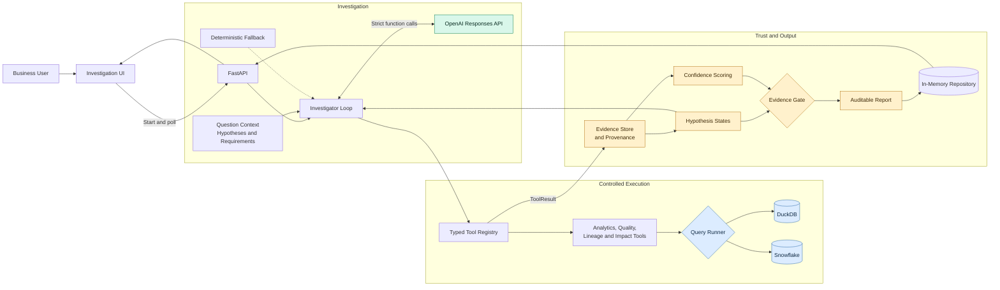

# InsightIQ Architecture

InsightIQ is an OpenAI-powered business investigation system. OpenAI plans the investigation and
selects from typed, allowlisted tools; deterministic application code executes queries, records
provenance, scores evidence, and decides whether a root cause can be published.

## Core Components

| Layer | Main technology | Responsibility |
|---|---|---|
| Experience | HTML, CSS, JavaScript, FastAPI | Question entry, live progress, hypotheses, evidence, and reports |
| Investigation | Python, OpenAI Responses API | Select the next evidence tool and produce a recommendation |
| Tools | Pydantic, typed function tools | Validate inputs and execute only registered capabilities |
| Data | DuckDB or Snowflake, dbt | Store business facts, quality metrics, and operational metadata |
| Trust | Deterministic Python rules, NetworkX | Track provenance, score evidence, validate causal chains, and export graphs |
| State | In-memory repository | Store live investigation state and completed reports |

## Runtime Flow

1. The user submits a business question through the UI.
2. Question context creates competing hypotheses and evidence requirements.
3. OpenAI selects one tool associated with an unresolved evidence requirement.
4. The Tool Registry validates arguments and executes a predefined warehouse query.
5. The result becomes observed evidence linked to its tool execution and query ID.
6. Hypotheses are supported, rejected, or marked as insufficient based on the evidence.
7. The Evidence Gate publishes a root cause only when confidence, provenance, causal links,
   competing-hypothesis resolution, and business impact are complete.

## Trust Boundary

OpenAI never receives unrestricted SQL access and does not execute warehouse queries. Metric names,
dimensions, schemas, and tool inputs are allowlisted. Business impact is calculated from warehouse
values, causal links cite recorded evidence IDs, and a failed gate returns **Root cause not
established** with the missing evidence requirements.

The current MVP runs background investigations in-process and stores state in memory. Production
deployment should add durable storage, a task queue, authentication, tenant isolation, managed
secrets, rate limits, and observability.
